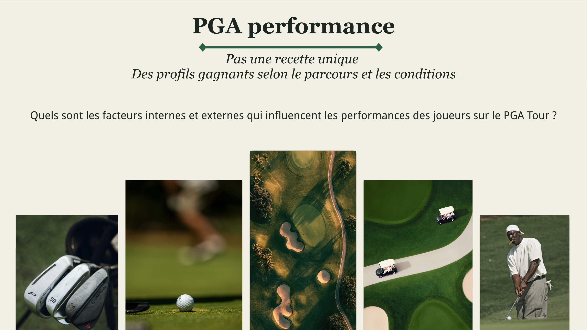
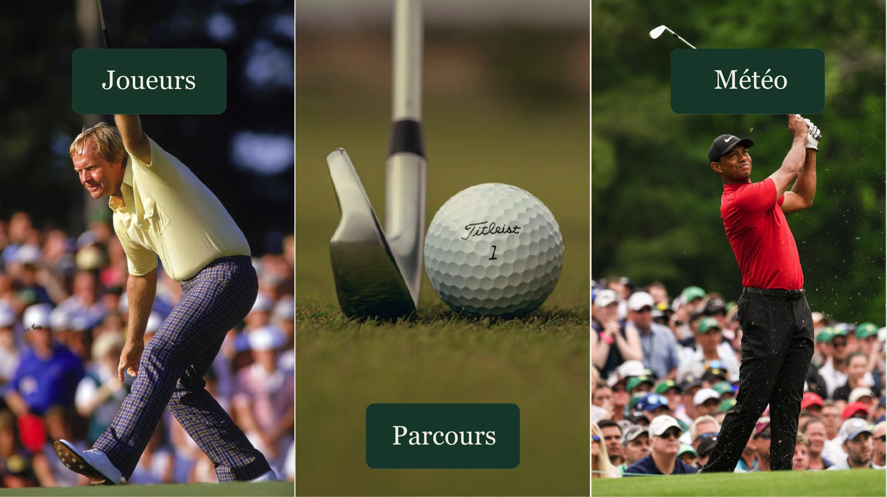
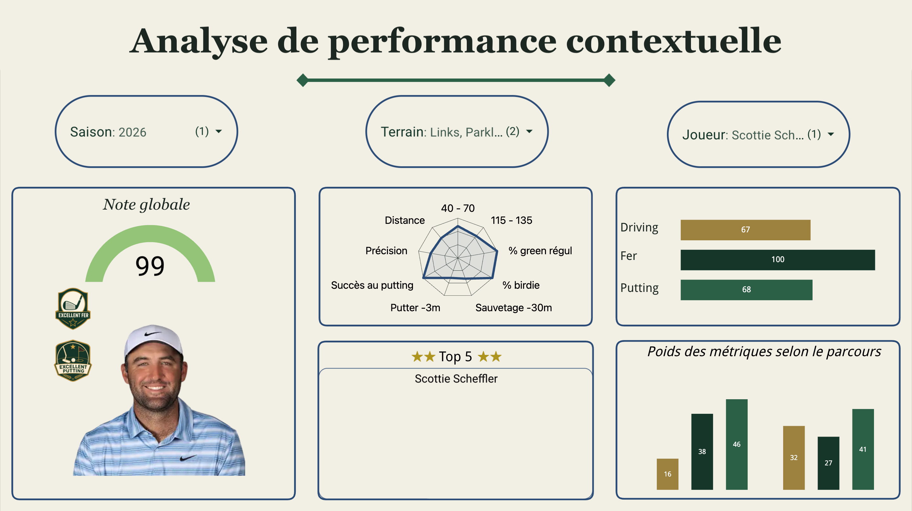
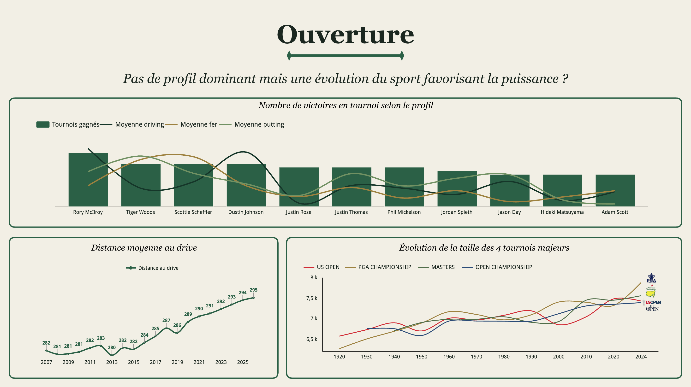

# PGA Performance — pas une recette unique

**Des profils gagnants selon le parcours et les conditions.**

Analyse de 19 saisons du PGA Tour (2007–2025) : **720 tournois**, **80 973 participations**, 11 sources hétérogènes.

> Quels sont les facteurs internes et externes qui influencent les performances des joueurs sur le PGA Tour ?

Projet de fin de formation — Le Wagon, septembre 2026.

**[→ Ouvrir le dashboard interactif](https://datastudio.google.com/s/tPB5N4a-vXM)**

---

## L'équipe

| Membre |
|---|
| **Souleymane N'Diaye** — [@juniorbaw](https://github.com/juniorbaw) 
| **Charles** 
| **Brice** — [@BriceGit](https://github.com/BriceGit) 
| **Salim** — [@salimelmalouani-bit](https://github.com/salimelmalouani-bit) 

---

## Aperçu

### La question



### Trois familles de facteurs



### Analyse contextuelle d'un joueur

La fiche combine un indice d'adaptation au type de parcours, des badges de compétence, un radar à neuf axes et des barres synthétiques pour le driving, les fers et le putting. Les poids affichés en bas à droite changent selon le terrain sélectionné.



### Ouverture



---

## Résultats

**1. Le vainqueur se distingue sur les trois aires de jeu, mais pas également.**

| Aire | Avantage moyen du vainqueur sur le plateau qu'il a battu |
|---|---|
| Putting | +0,78 écart-type |
| Distance au drive | +0,68 |
| Jeu de fer | +0,48 |

**2. Il n'existe pas un profil unique de vainqueur.** Les trois avantages sont peu corrélés entre eux (r = 0,17 à 0,24) : trois voies distinctes mènent à la victoire.

**3. La puissance est la seule qualité dont l'importance dépend du terrain.** Son avantage passe de +0,53 sur parcours facile à +0,79 sur parcours difficile. Le putting et le jeu de fer ne suivent aucune tendance.

**4. Le vent pénalise le plateau, la pluie non.** Corrélation de 0,44 contre 0,08 entre la variation de la condition et celle du score, mesurée entre le jeudi et le vendredi d'un même tournoi. Le vent coûte en moyenne **un coup** au plateau.

**5. Le vent nivelle les niveaux.** L'écart entre le meilleur et le pire profil de driving passe de 8,2 coups par vent faible à 3,9 par vent fort. **Le vent efface l'avantage des longs frappeurs.**

**6. La distance a gagné 13 yards en 19 saisons**, de 282 en 2007 à 295 en 2025, avec un décollage à partir de 2014. Les parcours de majeurs ont répondu en s'allongeant.

---

## Méthode

### Écart au plateau

Le score brut n'est pas comparable d'un tournoi à l'autre : les parcours et les plateaux diffèrent. Chaque performance est donc mesurée **relativement au plateau du jour** :

```
écart(joueur, tournoi, tour) = score − moyenne du plateau (tournoi, date, tour)
```

La clé de partition contient la **date de début**, pas la saison : sept tournois apparaissent deux fois dans la saison 2023 après la réorganisation du calendrier FedEx.

### Standardisation intra-saison

Le niveau du plateau dérive sur 19 saisons. Chaque métrique est donc centrée réduite **à l'intérieur de sa saison** :

```
z(joueur, saison, métrique) = (x − μ(saison, métrique)) / σ(saison, métrique)
```

Les métriques « plus bas = mieux » — proximités au drapeau, putts par green — sont inversées avant standardisation.

### Indice d'adaptation

Pour un type de parcours donné, les avantages mesurés chez les vainqueurs servent de **poids** :

```
indice = (p_drive × z_drive + p_fer × z_fer + p_putt × z_putt)
         / (p_drive + p_fer + p_putt)
```

Ce n'est pas une probabilité de victoire. C'est une mesure de proximité entre le profil d'un joueur et celui des vainqueurs passés dans des conditions comparables. **Aucun modèle n'a été entraîné.**

---

## Architecture

```
pga_stats      →   pga_staging      →   pga_calcul
sources brutes     nettoyé, typé        exposé à Looker
11 tables          8 tables             8 tables
```

Les flèches vont dans un seul sens. Toute modification en amont impose de recréer ce qui est en aval.

| Table | Lignes | Grain |
|---|---|---|
| `stg_resultats` | 104 928 | joueur × tournoi |
| `stg_tours` | 325 263 | joueur × tournoi × tour |
| `stg_meteo` | 572 | tournoi × tour, 2023–2025 |
| `dim_joueurs` | 728 | joueur, clé normalisée → PLAYER_ID |
| `mart_z_driving` / `_fer` / `_putting` | 3 737 | joueur × saison |
| `int_champ_tournoi` | 80 973 | participation |
| `mart_vainqueurs` | 720 | tournoi |

---

## Défauts de données corrigés

Onze sources, dix défauts documentés. **Aucun n'a levé d'erreur** : les requêtes tournaient, les nombres s'affichaient. Ils ont tous été trouvés par un contrôle.

| # | Défaut | Détecté par |
|---|---|---|
| 1 | Vitesse de tête de club ×100 sur toute la saison 2015 | distribution par saison |
| 2 | Greens en régulation en pourcentage jusqu'en 2022, en fraction ensuite | médiane par saison |
| 3 | Pourcentages stockés en texte à partir de 2023, sur trois fichiers | contrôle de type |
| 4 | En-tête absent, ligne de titre descendue en position 4331 | lecture des premières lignes |
| 5 | Libellés de tournois instables : 31 sur 66 identiques sur trois ans | taux d'appariement à la jointure |
| 6 | Sept tournois comptés deux fois dans la saison 2023 | comptage de dates par tournoi |
| 7 | Grain météo incohérent : `J1` = jeudi en 2023-24, lundi en 2025 | croisement round × jour de semaine |
| 8 | Doublon parfait résiduel (Sony Open 2012) | unicité de la clé après jointure |
| 9 | Échelles de z-scores divergentes : σ de 1,00 / 0,36 / 0,10 selon l'aire | écart-type par saison |
| 10 | **Signe inversé sur le composite putting** | top 5 d'une saison, lu par Charles |

Le dixième est le plus instructif. Le meilleur putteur de la saison 2023 sortait classé à **−3,44 écarts-types**. Détecté par une corrélation négative entre deux métriques qui auraient dû aller dans le même sens, puis confirmé en regardant simplement qui se trouvait en tête du classement.

**Aucun code ne pouvait trouver ce défaut. Il fallait connaître le golf.**

---

## Limites publiées

Elles sont sur les slides, pas en annexe.

- **La difficulté d'un parcours est confondue avec la force du plateau.** Les majeurs ont à la fois des parcours durs et les meilleurs joueurs. Nous ne pouvons pas séparer les deux.
- **Le composite putting inclut la conversion de birdie**, métrique en aval du score. L'avantage mesuré est probablement surestimé.
- **La météo est journalière, pas horaire, et nous n'avons pas les heures de départ.** L'effet de vague matin/après-midi ne peut pas être isolé.
- **Les vrais links ne représentent que 6 éditions** sur 143. Les valeurs affichées pour cette catégorie sont indicatives, jamais comparées statistiquement.
- **La classification des terrains est faite à la main**, à partir du nom du parcours. Elle est défendable mais n'est pas issue d'une source officielle.
- **Dollars courants**, non corrigés de l'inflation, sur les séries de dotations.

---

## Reproduire

```
sql/
  01_staging.sql        nettoyage, typage, correction des unités
  02_dim_joueurs.sql    clé normalisée nom → PLAYER_ID
  03_z_scores.sql       standardisation intra-saison, trois aires
  04_ecart_plateau.sql  performance relative au plateau
  05_vainqueurs.sql     avantage du vainqueur, par segment
  06_meteo.sql          reconstruction du grain, jointure conditions
  07_carte_joueur.sql   indice d'adaptation, badges, radar
notebooks/
  01_nettoyage.ipynb    contrôles à 4 dimensions : lignes, doublons, type, médiane
  02_meteo.ipynb        delta intra-tournoi, distributions
docs/
  profiling.md          audit des 11 sources
  lineage.md            quelle source alimente quelle table
  images/               captures du dashboard et de la présentation
figures/                figures matplotlib, script reproductible inclus
```

Chaque requête est suivie de ses contrôles. **Un chiffre publié doit être retrouvable par une commande.**

---

## Stack

BigQuery · SQL · Python (pandas, matplotlib) · Looker Studio · GitHub Pages

---

## Sources

Statistiques joueurs et résultats du PGA Tour, saisons 2007–2025. Données météorologiques par tournoi et par tour, 2023–2025. Longueur des parcours des quatre tournois majeurs.

Aucun identifiant, clé d'API ni fichier de credentials n'est présent dans ce dépôt.

### Historique de construction

- **27 août 2026** : ingestion, staging, dimensions, premiers Z-scores et vainqueurs ;
- **28 août 2026** : évolution des parcours et métriques de longueur ;
- **30 août 2026** : création du mart d'adéquation ;
- **1er septembre 2026** : création des bandes météo ;
- **2 septembre 2026** : finalisation du dashboard contextuel, badges, photos et spiders.
